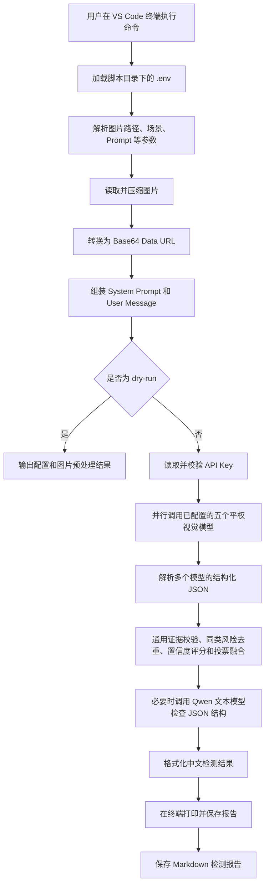

# DeepSeek Flash 施工安全快速检测代码流程说明

## 1. 文档目的

本文档用于说明 `DeepSeek Flash 施工安全快速检测` 项目的整体工作流程，便于项目交流、代码评审和后续扩展。

本项目的目标是：

1. 接收一张施工现场图片；
2. 由 DeepSeek Flash、Qwen、GLM、Kimi 和豆包等已配置视觉模型平权并行完成独立检测；
3. 输出图片中可见的安全违规点；
4. 给出可能对应的安全规范或条例；
5. 对无法通过图片确认的内容标记为“疑似违规”或提示复核；
6. 尽量在 8 秒内完成一次检测。

本项目是一个**快速初筛工具**，不是完整的安全工程验收系统。模型只能根据图片中可见的内容进行判断，不能代替现场测量、设备检测、资料审查或专业人员最终确认。

## 2. 项目目录

```text
deepseek_flash_safety_checker/
├── safety_check.py           # 主程序
├── requirements.txt          # Python 依赖
├── .env.example              # 环境变量模板
├── .env                      # 本地配置，不提交到代码仓库
├── .gitignore                # 忽略虚拟环境、密钥和输出文件
├── README.md                 # 快速安装和运行说明
├── 代码流程说明文档.md        # 本文档
├── .vscode/
│   └── launch.json           # VS Code 调试运行配置
└── outputs/                  # 检测结果保存目录，运行后自动生成
```

各文件职责如下：

| 文件 | 用途 |
|---|---|
| `safety_check.py` | 完成参数读取、图片处理、Prompt 组装、API 调用和结果保存 |
| `requirements.txt` | 安装 `httpx`、`python-dotenv`、`Pillow` |
| `.env` | 保存本地 API 配置和速度参数 |
| `.env.example` | 给其他开发者参考的配置模板 |
| `README.md` | 项目安装和基本使用说明 |
| `.vscode/launch.json` | 让用户可以从 VS Code 的 Run and Debug 面板启动程序 |
| `outputs/` | 保存每次检测生成的 Markdown 报告 |

## 3. 系统总体流程



程序的主路径最多包含五次并行视觉调用：DeepSeek Flash、Qwen、GLM、Kimi 和豆包都读取同一张图片，独立完成图片识别和安全判断，地位相同，不存在主模型替其他模型裁决的层级。多个模型完成后，系统按风险候选归并、模型支持数、模型自报置信度、风险状态和证据等级进行投票融合。若视觉检测失败且满足触发条件，才可能在剩余时间内调用一次 Qwen 文本模型做结构一致性检查；文本复核不能看图，也不能覆盖视觉模型事实。

## 4. 启动方式

程序支持命令行运行：

```bash
cd "/Users/gjz/Documents/ChatGPT/复杂环境安全巡检/deepseek_flash_safety_checker"
source .venv/bin/activate
python safety_check.py \
"/Users/gjz/safety- checker图片集/5c644383c3c01b7b_00008400.jpg" \
--scene "施工现场临时用电"
```

命令参数的含义：

| 参数 | 含义 |
|---|---|
| 第一个位置参数 | 待检测图片的路径 |
| `--scene` | 已知的检查场景，例如“施工现场临时用电” |
| `--prompt` | 可选的自定义检查要求 |
| `--output-dir` | 可选的结果保存目录 |
| `--no-save` | 只在终端输出，不保存 Markdown 文件 |
| `--dry-run` | 只执行配置读取和图片预处理，不调用 API |

如果已知图片属于临时用电场景，建议填写：

```bash
--scene "施工现场临时用电"
```

场景信息会作为上下文加入 Prompt，帮助模型把注意力集中在配电箱、电缆、接地、漏电保护、线路敷设等相关问题上。

## 5. 配置文件读取

程序启动后执行：

```python
load_dotenv(Path(__file__).with_name(".env"))
```

这表示程序始终读取 `safety_check.py` 所在目录下的 `.env`，不依赖终端当前工作目录。

这种方式可以避免以下问题：

- 从其他目录启动程序时找不到 `.env`；
- VS Code 的工作区目录和脚本目录不一致；
- 系统中存在多个 `.env` 文件，程序读取了错误文件。

`.env` 中的关键配置如下：

```env
DEEPSEEK_API_KEY=真实API密钥
DEEPSEEK_BASE_URL=https://api.deepseek.com/chat/completions
DEEPSEEK_MODEL=deepseek-flash
QWEN_API_KEY=通义千问真实API密钥
QWEN_BASE_URL=https://dashscope.aliyuncs.com/compatible-mode/v1/chat/completions
QWEN_REVIEW_MODEL=qwen3.8-flash
ENABLE_QWEN_VISION_REVIEW=true
QWEN_VISION_MODEL=qwen3.8-flash
ENABLE_THIRD_VISION_REVIEW=false
THIRD_VISION_BASE_URL=https://open.bigmodel.cn/api/paas/v4/chat/completions
THIRD_VISION_MODEL=glm-5.3-flash
REQUEST_TIMEOUT_SECONDS=8
QWEN_VISION_TIMEOUT_SECONDS=6.8
IMAGE_DETAIL=low
MAX_IMAGE_EDGE=768
JPEG_QUALITY=70
MAX_TOKENS=1100
TEMPERATURE=0
REASONING_EFFORT=none
```

DeepSeek 和 Qwen 的 API Key 只应保存在本地 `.env` 中，不应写入 Python 源代码、README、截图、论文或公开代码仓库。

## 6. 参数校验和默认值

程序会读取配置文件中的参数，并将文本转换成整数或浮点数。

例如：

```python
timeout_seconds = env_float("REQUEST_TIMEOUT_SECONDS", 8.0)
max_edge = env_int("MAX_IMAGE_EDGE", 1024)
max_tokens = env_int("MAX_TOKENS", 900)
temperature = env_float("TEMPERATURE", 0.0)
```

如果配置不存在或格式不正确，程序会使用默认值。

深度思考强度必须是以下四个值之一：

```text
none
low
high
max
```

如果填写其他值，程序会直接报错，不会发起 API 请求。

程序会根据思考强度计算实际请求的 `max_tokens` 最低值：

| 思考强度 | 实际请求 `max_tokens` 最低值 |
|---|---:|
| `none` | 600 |
| `low` | 900 |
| `high` | 2400 |
| `max` | 3200 |

这样可以为高强度思考和最终中文检测报告同时预留空间，避免思考过程耗尽 token 后没有最终输出。当前快速检测默认使用 `none`，通过增强 Prompt 和通用证据质量控制减少误判，优先保证 8 秒内稳定输出。

## 7. 图片预处理流程

图片预处理由 `prepare_image_data_url()` 完成。

### 7.1 检查图片是否存在

程序首先检查传入路径：

```python
if not image_path.exists():
    raise FileNotFoundError(...)
```

如果路径错误，程序会停止并输出图片不存在的错误，不会继续调用 API。

### 7.2 统一颜色格式

程序使用 Pillow 打开图片，并转换为 RGB：

```python
image = image.convert("RGB")
```

这样可以统一处理 JPG、PNG 等不同格式，避免部分图片包含透明通道或特殊颜色模式而导致接口处理失败。

### 7.3 控制图片尺寸

程序读取图片宽高，找到最长边：

```python
longest = max(width, height)
```

如果最长边超过 `MAX_IMAGE_EDGE`，就按照比例缩小图片。当前配置默认最大边长为 768 像素。

缩小图片的目的：

- 减少上传数据量；
- 缩短网络传输时间；
- 减少视觉模型处理负担；
- 降低超过 8 秒的概率。

程序不会强行拉伸图片，而是按照原始比例等比例缩放。

### 7.4 转换为 JPEG

图片经过处理后会以 JPEG 格式保存到内存缓冲区：

```python
image.save(buffer, format="JPEG", quality=quality, optimize=True)
```

默认质量为 75。图片不写入临时文件，而是直接保存在内存中，减少磁盘读写。

### 7.5 转换为 Base64 Data URL

API 请求需要能够直接读取图片，因此程序把 JPEG 二进制内容转换成 Base64：

```python
encoded = base64.b64encode(buffer.getvalue()).decode("ascii")
```

随后生成：

```text
data:image/jpeg;base64,......
```

这个 Data URL 会作为图片地址放入 API 请求中。

## 8. Prompt 组成方式

每个视觉模型请求中包含两类文字信息：

1. `system` 消息：规定模型的身份、判断边界和输出格式；
2. `user` 消息：包含具体任务、场景信息和图片。

### 8.1 System Prompt

System Prompt 的作用是固定模型的工作规则，主要要求包括：

- 只根据图片中清晰可见的内容判断；
- 不要臆测图片外的信息；
- 先建立对象清单，再检查人员关键部位、空间关系和多类别安全风险；
- 由模型自己完成图片识别、风险判断和安全规范匹配；
- 对每条风险返回对象可见性、证据等级和规范引用把握程度；
- 不能证明的内容标记为 `SUSPECTED` 或 `NOT_ASSESSABLE`；
- 只输出合法 JSON，最多 5 个风险项。

代码随后把 JSON 格式化为中文报告，但不会根据有限规则库重新决定违规类型。

### 8.2 User Prompt

默认 User Prompt 是：

```text
请根据图片中清晰可见的施工现场情况，快速识别存在的安全风险，
简要说明风险点，并指出对应的最新版安全规范或条例；
无法确认的不要臆测，直接说明“疑似违规”或“不可判断”。
```

如果命令中指定了场景，程序会在 User Prompt 前增加：

```text
已知检查场景：施工现场临时用电
```

场景和任务要求会与图片一起发送给模型。场景配置只提供检查重点、字段和主要规范背景，不会限制模型发现其他施工安全风险。

### 8.3 视觉部件和空间关系约束

对于配电箱、人员、吊装设备、脚手架等容易发生空间误判的对象，统一 Prompt 要求模型直接完成部件识别和风险判断，不由代码替模型裁决：

| 易误判项目 | 允许判定为明确违规的条件 | 证据不足时处理 |
|---|---|---|
| 配电箱主箱门与插座盖 | 模型根据各自的门板轮廓、铰链、开口、内部元件和接口形态分别判断 | 两个部件分别输出，不能互相替代 |
| 人员防护用品 | 人员对应的头部、躯干或挂点完整可见并有直接证据 | 未入镜或遮挡时只能写不可判断 |
| 吊物与人员空间关系 | 人员、吊物和危险区的相对位置清晰可见 | 仅凭重叠、边缘或距离感觉不能下结论 |
| 地面积水、裂缝、孔洞 | 看到边界、连续形态或其他直接视觉证据 | 不得把光影、反光和压缩伪影当成事实 |

这样做的目的不是把安全检查写成固定规则，而是让模型在多种工地场景中保持证据边界，并把视觉不确定性显式传递给代码和人工复核。

## 9. 深度思考强度控制

当前程序使用两个请求参数控制思考模式：

```json
"thinking": {
  "type": "enabled"
},
"reasoning_effort": "low"
```

其中：

| 配置 | 含义 | 速度 |
|---|---|---|
| `none` | 关闭思考 | 最快 |
| `low` | 开启最低程度思考 | 较快，当前任务推荐 |
| `high` | 较充分思考 | 较慢 |
| `max` | 最大思考强度 | 最慢 |

程序的处理逻辑是：

```python
if reasoning_effort == "none":
    thinking.type = "disabled"
else:
    thinking.type = "enabled"
    reasoning_effort = 当前配置值
```

对于当前“8 秒内快速判断施工安全风险”的任务，推荐：

```env
REASONING_EFFORT=none
```

原因是：

- 增强 Prompt 已经对临时用电高误判项加入证据约束；
- 代码层只校验证据等级和模型输出的一致性，不再强制改写配电箱箱门或插座盖的视觉结论；
- 使用 `low/high` 可能把输出 token 消耗在思考内容上，导致超时或没有最终报告；
- `temperature=0` 可以减少随机性。

## 10. API 请求结构

程序向 DeepSeek Chat Completions 地址发起 HTTP POST 请求。

请求头包括：

```http
Authorization: Bearer 真实API密钥
Content-Type: application/json
```

请求主体的主要结构如下，图片内容用省略号表示：

```json
{
  "model": "deepseek-flash",
  "messages": [
    {
      "role": "system",
      "content": "施工安全检查规则和输出要求"
    },
    {
      "role": "user",
      "content": [
        {
          "type": "text",
          "text": "场景信息和具体检查任务"
        },
        {
          "type": "image_url",
          "image_url": {
            "url": "data:image/jpeg;base64,...",
            "detail": "low"
          }
        }
      ]
    }
  ],
  "temperature": 0,
  "max_tokens": 900,
  "stream": false,
  "thinking": {
    "type": "enabled"
  },
  "reasoning_effort": "low"
}
```

其中：

- `model` 指定使用的模型；
- `messages` 携带 System Prompt、User Prompt 和图片；
- `temperature=0` 降低随机性；
- `max_tokens` 限制思考和最终输出的总长度，实际值会根据 `REASONING_EFFORT` 自动调整；
- `stream=false` 表示等待完整结果后一次返回；
- `image_url.detail=low` 优先保证速度；
- `thinking` 和 `reasoning_effort` 控制深度思考程度。

如果模型返回了 `reasoning_content`，但 `content` 为空，程序会认为模型没有生成最终检测报告，直接报错并提示增加 `MAX_TOKENS` 或降低思考强度，不会保存空白文件。

## 11. 8 秒控制机制

程序使用 HTTPX 设置请求超时：

```python
timeout = httpx.Timeout(
    timeout_seconds,
    connect=min(3.0, timeout_seconds)
)
```

默认 `REQUEST_TIMEOUT_SECONDS=8`，因此 API 请求超过 8 秒会触发超时异常。

程序还通过以下方法降低耗时：

1. 限制图片最大边长；
2. 使用 JPEG 压缩；
3. 使用 `detail=low`；
4. 限制输出最多 5 个违规点；
5. 设置较小的 `max_tokens`；
6. 使用 `REASONING_EFFORT=none`；
7. 已配置的 DeepSeek Flash、Qwen、GLM、Kimi 和豆包并行请求，避免串行增加多次视觉推理时间；
8. 只有视觉复检失败且结构确有冲突时，才在剩余预算中调用文本复核；并行视觉请求会为 JSON 解析、投票融合和报告保存预留时间。

需要说明的是，8 秒超时是程序对 API 请求的控制，不代表任何网络环境下都能绝对保证端到端 8 秒完成。实际耗时还会受到以下因素影响：

- 本地图片处理时间；
- 网络上传速度；
- DeepSeek API 排队时间；
- 模型推理时间；
- 服务端临时负载。

因此，实际测试时应记录每张图片的真实耗时，并进行多张图片、多次重复测试。

## 12. Dry Run 流程

执行：

```bash
python safety_check.py \
"/图片路径.jpg" \
--scene "施工现场临时用电" \
--dry-run
```

程序会执行：

1. 读取 `.env`；
2. 读取命令行参数；
3. 检查图片是否存在；
4. 压缩图片；
5. 生成 Base64 Data URL；
6. 组装请求参数；
7. 输出配置检查结果。

程序不会执行：

- API Key 校验；
- 网络请求；
- DeepSeek 模型推理；
- 检测报告保存。

典型输出：

```text
DRY RUN OK
image=/图片路径.jpg
model=deepseek-flash
base_url=https://api.deepseek.com/chat/completions
timeout=8.0s
image_detail=low
max_image_edge=1024
jpeg_quality=75
reasoning_effort=low
payload_image_data_url_size≈54.6KB
prepare_elapsed=0.05s
```

Dry Run 通过只能说明本地配置和图片预处理正常，不能说明 API Key 有效或模型调用成功。

## 13. 真实 API 调用流程

真实运行时，程序在完成图片和请求组装后检查 API Key：

```python
api_key = os.getenv("DEEPSEEK_API_KEY", "").strip()
```

如果 Key 不存在或仍为占位符：

```text
ERROR: Please set DEEPSEEK_API_KEY in .env first.
```

如果 Key 存在，程序继续调用：

```python
response = client.post(
    base_url,
    headers=headers,
    json=payload
)
```

调用成功后，程序从响应中读取：

```python
data["choices"][0]["message"]["content"]
```

这段内容就是模型生成的中文检测报告。

在保存报告前，程序只执行通用结果质量控制：

```text
模型视觉判断
→ 检查 target_visibility 和 evidence_level
→ 对证据不足的结论降级
→ 对多个模型的同类风险保守去重并保留少数候选
→ 输出模型最终判断
```

对于配电箱，主箱门、插座盖、插头、接线端子和电缆接口由视觉模型分别识别。代码不再根据关键词把“箱门打开”改写成“插座口外露”，也不使用固定规则覆盖 DeepSeek Flash 的视觉结论。

## 14. 结果输出和保存

模型结果会首先打印在终端：

```text
耗时：6.23 秒

基于图片中清晰可见的施工现场情况，识别出以下安全违规点及对应的安全规范：

1. 违规点：配电箱周围堆放大量杂物
• 现象描述：配电箱前方和周边存在纸箱等物品，影响操作空间。
• 违反的具体安全条例：《建筑与市政工程施工现场临时用电安全技术标准》JGJ/T 46-2024 第……条：……
  查询链接：https://gf.cabr-fire.com/article-68828.htm
```

如果没有使用 `--no-save`，程序还会把结果写入 `outputs/`：

```text
outputs/
└── 20260920-153000-图片名称-result.md
```

保存内容包括：

- 报告标题；
- 图片路径；
- 本次耗时；
- 模型返回、证据字段校验、模型来源、投票置信度和差异提示后的检测结果。

## 15. 异常处理

程序对主要错误进行处理：

### 15.1 图片不存在

输出图片路径错误，不会发起 API 请求。

### 15.2 API Key 缺失

提示在 `.env` 中填写 `DEEPSEEK_API_KEY`。

### 15.3 请求超时

输出：

```text
ERROR: API call exceeded 8.0 seconds.
```

建议降低：

```env
MAX_IMAGE_EDGE=768
MAX_TOKENS=600
```

### 15.4 HTTP 错误

HTTPX 会对非成功状态码抛出异常，程序捕获后输出错误信息。

常见原因包括：

- API Key 无效；
- 账户余额或权限问题；
- 模型名称错误；
- API 地址错误；
- 服务端暂时不可用。

### 15.5 返回格式异常

如果 API 返回内容中找不到：

```text
choices[0].message.content
```

程序会提示返回结构异常，避免把错误响应误当成正常检测结果。

## 16. 当前版本的边界

当前版本具备以下能力：

- 单张图片检测；
- 单次 API 调用；
- 支持临时用电等场景提示；
- 支持图片压缩；
- 支持低细节图片输入；
- 支持关闭或调整思考强度；
- 支持 8 秒请求超时；
- 支持终端和 Markdown 输出；
- 支持 VS Code 调试运行。

当前版本暂未实现：

- 多张图片批量检测；
- 自动读取完整法规数据库；
- 对法规条款进行本地检索和事实校验；
- OCR 读取图片中的文字；
- 自动框选违规区域；
- 多轮复核；
- 结果结构化入库；
- 与 SafeChecker 的 L0-L7 主流程直接集成。

因此，模型输出的规范名称和条款编号仍应由安全专业人员复核。尤其当图片无法直接证明尺寸、距离、接地连续性、漏电保护功能或管理资料状态时，不能只凭模型结果作最终合规结论。

## 17. 测试建议

建议准备以下类型的图片进行测试：

1. 配电箱周围堆放易燃杂物；
2. 配电箱前方无绝缘垫；
3. 电缆沿地面拖设；
4. 配电箱门打开或疑似未上锁；
5. 图片清晰、无明显违规；
6. 图片模糊或关键部位被遮挡；
7. 与临时用电无关的施工现场图片。

每张图片至少测试 3 次，并记录：

| 项目 | 记录内容 |
|---|---|
| 图片名称 | 测试样本名称 |
| 场景 | 例如施工现场临时用电 |
| 是否识别出风险 | 是/否 |
| 违规点 | 模型输出的简要描述 |
| 违反的具体安全条例 | 程序从已核验法规条款库输出的标准名称、条款号、条文原文和查询链接 |
| 是否正确 | 人工复核结果 |
| 耗时 | 终端显示的秒数 |
| 是否超时 | 是否超过 8 秒 |

可以使用以下命令进行单张测试：

```bash
python safety_check.py \
"/图片/绝对路径.jpg" \
--scene "施工现场临时用电"
```

## 18. 后续扩展方向

如果第一阶段测试结果稳定，可以继续扩展：

1. 增加批量图片测试脚本；
2. 将每次检测结果保存为 JSON 和 CSV；
3. 使用 `verified_regulations.py` 中的已核验法规条款数据库；
4. 使用本地规则库辅助校验模型输出；
5. 增加图片中的违规区域坐标；
6. 对模型返回的 `citation_key` 做白名单校验，未知键降级为“暂未匹配到已核验的具体条文”；
7. 增加重试和备用模型；
7. 将快速检测结果接入 SafeChecker 的完整分析流程；
8. 增加人工复核界面；
9. 对准确率、召回率、平均耗时和超时率进行统计。

## 19. 一句话总结

本项目通过“读取配置 → 压缩图片 → 按场景构造统一模型安全检查 Prompt → 已配置的五个平权视觉模型并行完成图片识别和安全判断 → 保守归并同类风险 → 按模型支持数、证据质量和模型覆盖率进行投票融合 → 必要时 Qwen 文本逻辑复核 → 模型判断结果格式化输出 → 打印并保存报告”的流程，在尽量控制响应时间的同时，对施工现场图片进行复杂安全风险快速初筛。

当前代码中的场景配置主要用于给模型提供检查方向、结构化事实字段和规范背景，不再作为有限规则引擎直接裁决全部违规。实际安全风险判断由视觉大模型完成，代码负责请求编排、结构校验、证据质量控制、去重和格式化。

## 20. 2026年9月新增的可靠性修正

### 20.1 `not_applicable` 状态

事实字段现在支持四种状态：

```text
yes
no
uncertain
not_applicable
```

`not_applicable` 表示当前图片没有该对象，或当前场景不适用。它与 `uncertain` 不同：

- `uncertain`：对象存在，但图片证据不足；
- `not_applicable`：没有对象，不能对该对象进行检查。

模型可以把未出现的对象标记为 `not_applicable`，把对象存在但状态不清晰标记为 `uncertain`。代码保留这些模型字段，不根据箱门、电缆或其他领域关键词强制重写。

### 20.2 多场景规则选择

当命令指定：

```bash
--scene "起重吊装作业"
```

程序会选择起重吊装规则包，重点检查吊物、吊索具、吊钩防脱、人员站位、支腿垫板、警戒隔离、溜绳控制等可视风险，不再把吊装钢丝绳、吊带或软管作为电气电缆处理。

临时用电检测应使用：

```bash
--scene "施工现场临时用电"
```

### 20.3 多模型职责与投票融合

当前已配置的视觉模型全部平权：DeepSeek Flash、Qwen、GLM、Kimi 和豆包同时读取同一张图片，分别输出 `facts + issues`，每个模型都承担图片识别和安全判断职责。某个模型调用失败时，其他已返回模型仍可参与投票，报告会在模型参与情况中标出“未返回”。

风险归并采用保守策略：先比较模型给出的稳定 `risk_key`，再检查目标对象、空间位置和证据文本是否相容；法规编号只用于条款关联，不能作为自动合并条件。因此，同一法规下的配电箱箱门、插座盖、接线端子等不同对象，或不同位置的风险，可以分别保留；只有同一根本风险且对象和位置相容时才合并。

投票结果同时保留多数与少数候选。多数模型支持的风险优先展示；只有一个或少数模型支持、但证据字段能够描述图片现象的风险也不会被删除，而是标记为“少数模型发现，待人工复核”。风险的融合置信度由证据、共识、配置覆盖率和模型完成率共同决定：`model_evidence_confidence` 是支持模型的证据质量均值，`consensus_score` 是支持模型数除以已完成模型数，`configured_support_rate` 是支持模型数除以已配置模型数，`model_availability_rate` 是已完成模型数除以已配置模型数；`vote_confidence` 先计算前三项，再按模型完成率进行可用率惩罚。这样可以区分“某一个模型很自信”和“多个模型形成共识”，避免只有部分模型返回时因响应之间恰好一致而产生虚高置信度。

### 20.4 验证结果

2026年9月21日验证：

- 吊装图片：约 2.72 秒返回，进入起重吊装专项规则；
- 临时用电图片：约 2.58 秒返回，正常生成电缆、插座口和固定状态结果；
- 事实归一化测试：对象为 `no` 时，相关检查字段正确变为 `not_applicable`。

### 20.5 高精度模型检查协议

当前版本坚持“大模型负责主要安全检测，代码负责严格检查协议和结果质量控制”的分工。

模型在 Prompt 中被要求依次完成：

```text
对象清单
→ 人员及关键部位完整性
→ 空间关系
→ 多类别风险扫描
→ 安全规范匹配
→ 证据自检
```

每条模型风险结果需要说明：

- `target`：风险对象或人员编号；
- `target_visibility`：风险对象是完整、部分、被遮挡还是未入镜；
- `evidence_level`：证据是直接、部分、遮挡、未入镜还是存在歧义；
- `citation_confidence`：规范条款引用的把握程度。

代码不根据有限的违规规则库替模型判断风险，只进行以下通用质量控制：

1. 如果关键部位未入镜或被遮挡，禁止保留“明确违规”；
2. 如果模型写“未佩戴、缺失、未设置”等缺失类结论，但目标区域不完整可见，降级为“不可判断”；
3. 如果模型给出具体条款但自报引用把握不足，自动追加“条款编号需复核”；
4. 对模型发现的同一根本风险进行保守去重；法规编号相同但目标或位置不同的风险不自动合并；
5. 保留可描述的少数模型候选并标记待人工复核，同时记录所有模型的来源、状态和事实差异；代码不由规则库新增或改写安全风险；
6. 文本复核模型只能检查 JSON 内部结构，不能覆盖主模型的视觉事实。

例如本次配电箱图片中，模型识别到人员身体部分入镜，但头部没有完整入镜，最终输出：

```text
不可判断：人员疑似未佩戴安全帽
现象描述：画面仅见人员手臂和腿部，头部未完整入镜，无法判断安全帽佩戴状态。
```

这不是代码预设了“安全帽规则”，而是模型完成安全检查后，代码根据模型给出的 `target_visibility=not_visible` 和 `evidence_level=not_visible` 执行通用证据质量控制。
